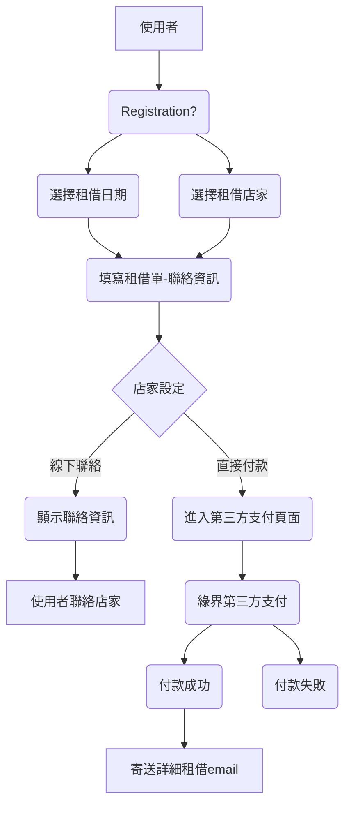

# Hiking-lend

## System

Built by:
- Web App: Python (Flask)
- Database: PostgreSQL
- Front-end Framework: [UIkit](https://getuikit.com/)

## Design

### 流程概略



## Development

1. Install Docker

build local deployment docker image

2. docker build & up

```bash
docker compose build
'''

start local deployment environment

'''bash
docker compose up
```

### Deployment

1. Build production image

```bash
sudo docker compose -f compose.yml -f compose.prod.yml build
```

2. Start production container

```bash
sudo docker compose -f compose.yml -f compose.prod.yml up
```
